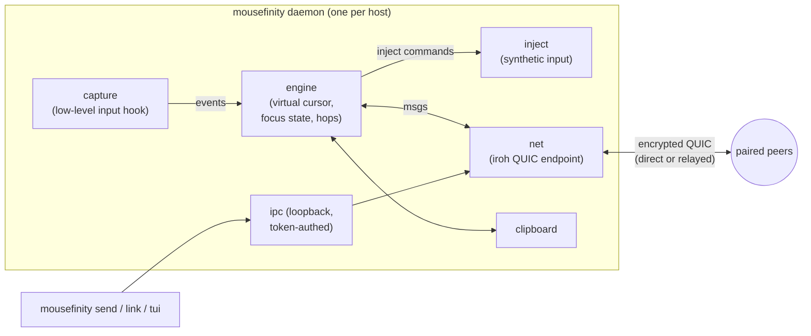
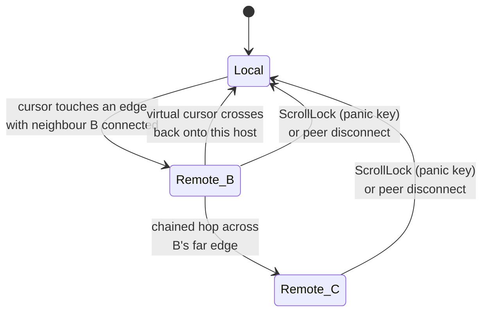

# mousefinity

Share one mouse and keyboard across multiple computers — plus clipboard sync
and file transfer — over secure peer-to-peer connections that work across the
internet, not just your LAN.

Move the cursor off the edge of one screen and it appears on the next machine,
exactly like a multi-monitor setup, except each "monitor" is a different
computer. You decide how the screens are arranged.

## Highlights

- **Standalone** — one static binary, no accounts, no central server you must
  run. (Connections bootstrap through public [iroh](https://iroh.computer)
  relays and fall back to them when hole-punching fails; you can self-host
  those too.)
- **Fast & memory-safe** — written entirely in Rust.
- **Works across the internet** — connectivity via QUIC with NAT
  hole-punching. Peers find each other by public key through relay + DNS
  discovery; when a direct path exists it is used, otherwise traffic falls
  back to an encrypted relay. No port forwarding needed.
- **Secure by construction** — every connection is end-to-end encrypted
  (TLS 1.3 over QUIC). A peer *is* its Ed25519 public key: pairing means
  exchanging ids once, and anything not on your peer list is refused at the
  handshake.
- **Clipboard sync** — the clipboard follows you as you hop between screens
  (text, up to 4 MiB).
- **File transfer** — `mousefinity send laptop big.iso` streams a file
  directly to a paired peer's downloads folder.
- **Seamless hopping** — configurable screen arrangement (left/right/up/down
  of each other), proportional cursor entry between screens of different
  resolutions, chained hops across 3+ machines, and a panic key
  (ScrollLock) that always yanks control back to the machine with the
  physical keyboard.

## Install

Grab a prebuilt binary from the
[releases page](https://github.com/wizix66/mousefinity/releases)
(Windows, Linux, macOS Intel + Apple Silicon), or build from source:

```sh
cargo build --release          # produces target/release/mousefinity(.exe)
```

Windows note: on the GNU toolchain, build with dependency optimization (the
default dev profile here already does) — see `Cargo.toml`.

## Setup (two machines: `desktop` and `laptop`)

On each machine:

```sh
mousefinity init               # creates identity + config, prints pairing id
```

Exchange the printed pairing ids (they are public keys — safe to share):

```sh
# on desktop
mousefinity add-peer laptop  <laptop's id>
# on laptop
mousefinity add-peer desktop <desktop's id>
```

Arrange the screens **on either machine** (the layout syncs to every
connected peer automatically — newest edit wins):

```sh
mousefinity link desktop right laptop     # laptop sits to the right
```

Prefer something friendlier? `mousefinity tui` opens an interactive
configuration UI: add/remove peers (Ctrl-V pastes a pairing id), copy your
own id, and set each screen's neighbours with the arrow keys. Saving pokes a
running daemon so changes apply — and sync — immediately, no restart needed
for layout edits.

Then start the daemon on both:

```sh
mousefinity run
```

Push the cursor off desktop's right edge — it lands on the laptop. Keyboard,
mouse buttons and scrolling follow the cursor. Copy text on one machine,
paste on the other. ScrollLock instantly returns control home.

Send a file to whichever peer you like (daemon must be running):

```sh
mousefinity send laptop path/to/file.pdf   # lands in ~/Downloads/mousefinity
```

## Configuration

`~/.config/mousefinity/config.toml` (Linux/macOS) or
`%APPDATA%\mousefinity\config.toml` (Windows). Everything the CLI does you
can also edit by hand:

```toml
name = "desktop"
# screen = [2560, 1440]        # override auto-detected size if needed
# downloads = "D:/incoming"    # where received files land

[network]                      # optional section
port = 48800                   # fixed UDP listen port (firewall rules, static addrs)
# relay = "off"                # never touch public relays: direct/LAN only
# relay = "https://relay.example.com"   # self-hosted relay (same on every host)

[peers.laptop]
id = "3fa9…"                   # from `mousefinity id` on that machine
# static addresses to try in addition to discovery — for routed LANs,
# VPNs, or firewall-allowlisted setups; needs a fixed port on that peer
addrs = ["192.168.1.50:48800", "10.8.0.2:48800"]

[layout.desktop]
right = "laptop"

[layout.laptop]
left = "desktop"
```

The layout is a graph, not a grid — chain as many machines as you like
(`desktop → laptop → mac`), including vertical stacking with `up`/`down`.
Hops work between any two machines that are direct neighbours in the layout;
each machine only needs a peering entry for machines it talks to directly.

**Layout syncs itself.** Every edit (via `link` or the TUI) stamps a
revision; peers exchange layouts when they connect and gossip newer
revisions onward, so you only ever edit the arrangement on one machine.
Trust does *not* sync, by design: each machine decides for itself which
public keys it accepts, so `add-peer` stays a per-machine step.

The identity key lives next to the config (`secret.key`). Protect it like an
SSH private key; the pairing id printed by `init`/`id` is the public half.

## Platform support

| Platform | Control others | Be controlled | Clipboard | Files | Notes |
| -------- | -------------- | ------------- | --------- | ----- | ----- |
| Windows  | ✅ | ✅ | ✅ | ✅ | DPI-aware; low-level hooks |
| macOS    | ✅ | ✅ | ✅ | ✅ | grant Accessibility + Input Monitoring to the binary |
| Linux X11 | ✅ | ✅ | ✅ | ✅ | capture uses evdev: add your user to the `input` group |
| Linux Wayland | ⚠️ | ⚠️ | ✅ | ✅ | injection depends on compositor support; capture via evdev |
| Android  | 🚧 | 🚧 | 🚧 | 🚧 | core crates build for `aarch64-linux-android`; needs an AccessibilityService app shell (planned) |
| iOS      | 🚧 | ❌ | 🚧 | 🚧 | Apple provides no API for system-wide input injection; an iOS node can only ever be a controller/clipboard/file peer, not a controlled screen |

The protocol and networking crates (`mousefinity-proto`, and the transport in
the main crate) are pure Rust with no desktop dependencies and compile for
both mobile targets today; what's missing is the platform shell (Kotlin
AccessibilityService / Swift app) that hosts them. This is the documented
path, not a hidden limitation: **no** third-party tool can inject
system-wide input on stock iOS.

## Requirements

| | Build | Run |
| --- | --- | --- |
| Windows | Rust stable (MSVC or GNU toolchain) | Windows 10+; first run may show a Defender Firewall prompt — allowing it is recommended but *outgoing* control of other machines works even without it |
| macOS | Rust stable + Xcode CLT | macOS 10.15+; grant **Accessibility** and **Input Monitoring** to the binary (System Settings → Privacy & Security) |
| Linux (X11) | Rust stable, `libx11-dev libxtst-dev libxi-dev libevdev-dev libxdo-dev` | X11 session; user in the `input` group for capture |
| Network | — | Outbound UDP + outbound TCP 443 (see [ports](#ports--firewalls)); no port forwarding, no inbound rules required in the common case |

## Architecture

Every host runs the same daemon; there is no server role. Inside one host:



The machine with the physical mouse is **authoritative**: it tracks the
virtual cursor across every screen in the layout (learning each peer's
resolution at handshake), decides edge hops, and streams absolute positions
to whichever peer is focused. Controlled peers never make hop decisions,
which prevents feedback loops from injected events.



While remote, all local input is swallowed and forwarded; the physical
cursor parks at the screen centre so every hook event yields a clean
relative delta. Clipboard is pushed to the peer you hop to and handed back
when you leave. File transfers use a separate QUIC connection per transfer
(`ALPN mousefinity/file/1`), streamed with backpressure; receivers only
ever write inside their downloads directory (path components stripped).

## Networking: how peers find each other

Connection setup is **LAN-first by construction**: every candidate path is
discovered and raced concurrently, and the connection migrates to the best
(lowest-latency) working path — a same-LAN direct route beats everything
else, and the relay is only used while no direct path works.

```mermaid
sequenceDiagram
    participant A as host A
    participant M as mDNS (local network)
    participant D as discovery (DNS + HTTPS pkarr)
    participant R as relay (TLS 443)
    participant B as host B
    Note over A,B: both daemons publish: all local interface IPs,<br/>observed public address, home relay
    A->>M: who has B's key? (zero internet needed)
    A->>D: lookup B's key (TXT record, HTTPS fallback)
    M-->>A: B's LAN addresses
    D-->>A: B's addresses + relay
    par race all candidates
        A->>B: QUIC to LAN / routed private IPs
    and
        A->>B: QUIC to public address (hole-punch)
    and
        A->>R: QUIC via relay
        R->>B: forward (still end-to-end encrypted)
    end
    Note over A,B: first working path carries traffic;<br/>connection migrates to the best direct path
```

Details that matter for your network:

- **All local IPs are advertised.** Each daemon publishes every interface
  address it has (Ethernet, Wi-Fi, VPN…) both via mDNS on the local network
  and in its discovery record. Two sites with routed private networks
  (e.g. an IPsec/WireGuard tunnel between LANs) connect directly across the
  tunnel without any special configuration.
- **mDNS works with zero internet.** Two laptops on the same switch pair
  and work with the internet cable unplugged (`relay = "off"` makes that a
  guarantee rather than a fallback).
- **Static addresses beat discovery.** `addrs = ["ip:port"]` under a peer
  pins known routes (fixed office IP, VPN address). Combined with
  `network.port` on the other side, two hosts connect with no discovery
  infrastructure at all.
- **Discovery survives DNS filtering.** Records are resolved via DNS *and*
  via HTTPS (pkarr relay), so networks that block TXT lookups still work.

## Ports & firewalls

**The common case needs no inbound rules and no port forwarding.** All flows
below are outbound; stateful firewalls allow the replies automatically.

| Direction | Protocol / port | Purpose | Needed when |
| --- | --- | --- | --- |
| outbound | UDP, high ports | QUIC to peers (direct paths) + relay QAD probes | always (unless `relay="off"` and UDP blocked → nothing works) |
| outbound | TCP 443 (TLS) | relay connection + HTTPS discovery fallback | internet-crossing setups, UDP-hostile networks |
| outbound | UDP 53 / DoH | DNS discovery lookups | internet-crossing setups (HTTPS fallback exists) |
| local multicast | UDP 5353 (mDNS) | LAN peer discovery | same-LAN discovery |
| inbound (optional) | UDP `network.port` | direct connections from peers using static `addrs` | only for pinned/allowlisted setups |

Playbook, from easiest to most locked-down:

1. **Home / office LAN** — nothing to do. mDNS finds peers; direct QUIC on
   the LAN carries everything.
2. **Across the internet, normal NAT (home router)** — nothing to do.
   Hole-punching establishes a direct path in the common case; otherwise
   traffic rides the relay (encrypted end to end — relays only ever see
   ciphertext).
3. **One or both hosts behind corporate/strict firewalls** — outbound-only
   firewalls still work: hole-punching makes *both* flows outbound-initiated,
   and if UDP is blocked entirely the relay path over TCP 443 carries
   traffic (with some added latency). If the network also filters DNS, the
   HTTPS discovery fallback covers it. For the best odds on Windows, allow
   the app when Defender Firewall prompts (or add an inbound UDP rule for a
   fixed `network.port`) — this lets direct paths form even when the peer's
   first packet arrives before yours leaves.
4. **Both sites are locked down but route to each other** (site-to-site VPN,
   MPLS, tailnet): set `network.port` on both, list each other's private
   IPs in `addrs`, and optionally `relay = "off"` — fully self-contained
   operation with no third-party infrastructure.
5. **Public relays unreachable?** Self-host one and point every host at it
   (see below). With a shared custom relay, peers are dialed *through that
   relay directly* — no discovery infrastructure is needed at all, so this
   also survives fully filtered DNS.

### Diagnosing a connection: `mousefinity doctor`

When two hosts won't link up, run this on each of them:

```text
$ mousefinity doctor
mousefinity doctor — host `alpha`
  pairing id: b754…
  [ ok ] bind: endpoint up
  [ ok ] udp egress: works (ipv4: true, ipv6: false) — direct paths & hole-punching possible
  [ ok ] public address: 99.243.139.221:48800 (ipv4)
  [ ok ] relay: reachable, closest: https://use1-1.relay.n0.iroh.link./
  [ ok ] home relay: connected to https://use1-1.relay.n0.iroh.link./
  [ ok ] peer beta: connected & mutually paired — direct ip:10.10.10.167:62896 rtt 663µs *active*
```

It checks, in order: outbound UDP (can direct paths exist at all?), NAT
type (symmetric NATs defeat hole-punching), captive portals, relay
reachability incl. TLS errors (spot TLS-inspecting proxies here), and then
actually connects to every configured peer, reporting whether the working
path is **direct** or **relay** and its latency. Run it on both ends: each
side's failures tell you what *that* network blocks.

### Self-hosting a relay

For networks where n0's public relays are blocked (or for full
independence), run [iroh-relay](https://github.com/n0-computer/iroh) on any
server both sides can reach over TCP 443:

```sh
cargo install iroh-relay --features server
iroh-relay --dev            # dev mode; for production use TLS on 443
```

Production wants a TLS certificate (Let's Encrypt) and inbound TCP 443
open on the server — see the iroh-relay docs for the config file. Then on
**every** mousefinity host:

```toml
[network]
relay = "https://relay.your-domain.com"
```

Traffic through your relay is still end-to-end encrypted; the relay sees
only ciphertext, and only your machines' keys can use your mousefinity
peers — but note anyone who can reach an open relay can use it to carry
their own iroh traffic, so restrict it (firewall allowlists or
`access_control` in the relay config) if that matters to you.

## Security model

- Identity = Ed25519 keypair, generated at `init`, never leaves the machine.
- Peering is explicit and mutual: each side must `add-peer` the other's
  public key. Unknown keys are rejected before any application data flows.
- All traffic (input, clipboard, files) rides TLS-1.3-encrypted QUIC;
  relays only ever see ciphertext.
- Received files: only the file *name* is honoured, never a path; name
  collisions get ` (n)` suffixes; files land only in the configured
  downloads directory.
- Emergency release: ScrollLock returns control to the local machine even if
  the focused peer hangs or vanishes (peer loss also auto-releases).

## Limitations (v0.1)

- Layout edits sync between connected daemons; a machine that was offline
  catches up when it reconnects. If two people edit layouts simultaneously
  on different machines, the newest timestamp wins.
- Clipboard is text-only; images/rich content planned.
- Key forwarding assumes a US-QWERTY *sender* for printable characters
  (named keys — arrows, modifiers, function keys — are layout-independent).
- One screen per host is modelled: with multi-monitor hosts, set `screen` to
  your primary monitor and prefer hop edges not covered by a second monitor.
- Modifier state is not re-synchronized across a hop; release modifiers
  before hopping.
- Android/iOS shells are not implemented yet (see the support matrix).

## License

MIT or Apache-2.0, at your option.
