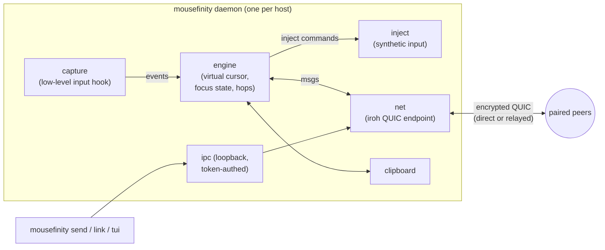
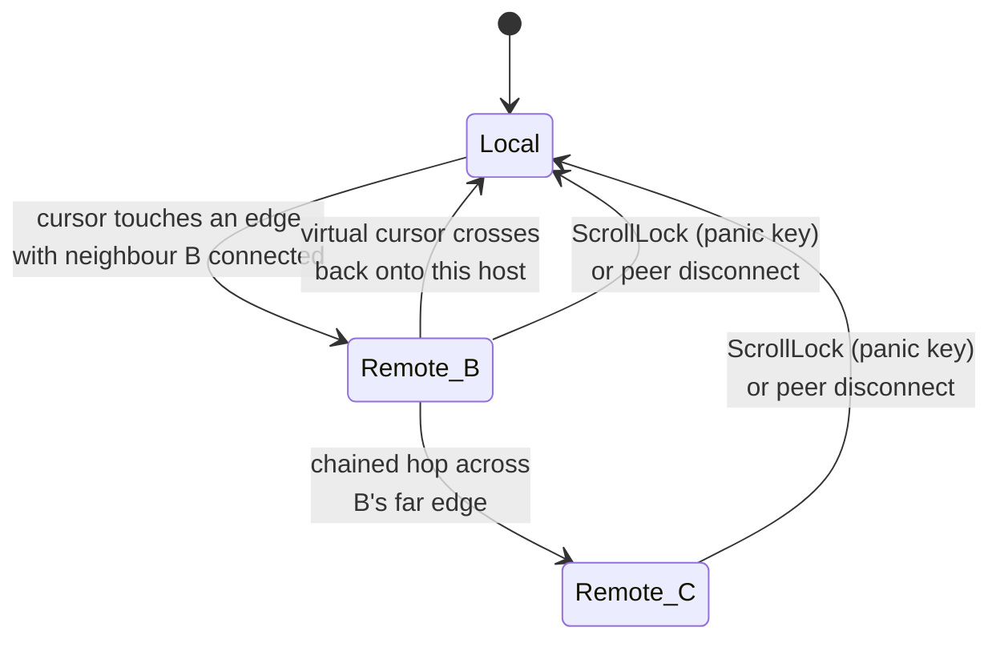
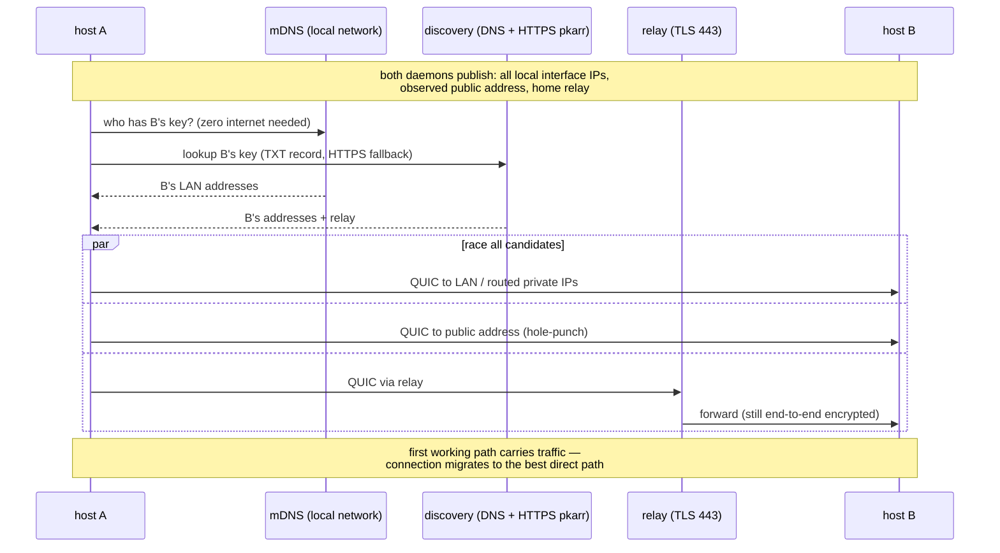

# mousefinity

Share one mouse and keyboard across multiple computers — plus clipboard sync
and file transfer — over secure peer-to-peer connections that work across the
internet, not just your LAN.

Move the cursor off the edge of one screen and it appears on the next machine,
exactly like a multi-monitor setup, except each "monitor" is a different
computer. You decide how the screens are arranged.

## Highlights

- **Standalone** — one static binary, no accounts, no central server you must
  run. (Connections bootstrap through public [iroh](https://iroh.computer)
  relays and fall back to them when hole-punching fails; you can self-host
  those too.)
- **Fast & memory-safe** — written entirely in Rust.
- **Works across the internet** — connectivity via QUIC with NAT
  hole-punching. Peers find each other by public key through relay + DNS
  discovery; when a direct path exists it is used, otherwise traffic falls
  back to an encrypted relay. No port forwarding needed.
- **Secure by construction** — every connection is end-to-end encrypted
  (TLS 1.3 over QUIC). A peer *is* its Ed25519 public key: pairing means
  exchanging ids once, and anything not on your peer list is refused at the
  handshake.
- **Clipboard sync** — the clipboard follows you as you hop between screens
  (text, up to 4 MiB).
- **File transfer** — `mousefinity send laptop big.iso` streams a file
  directly to a paired peer's downloads folder.
- **Seamless hopping** — configurable screen arrangement (left/right/up/down
  of each other), proportional cursor entry between screens of different
  resolutions, chained hops across 3+ machines, and a panic key
  (ScrollLock) that always yanks control back to the machine with the
  physical keyboard.

## Install

Grab a prebuilt binary from the
[releases page](https://github.com/wizix66/mousefinity/releases)
(Windows, Linux x86-64 and arm64, macOS Intel + Apple Silicon), or build from
source:

```sh
cargo build --release          # produces target/release/mousefinity(.exe)
```

Windows note: on the GNU toolchain, build with dependency optimization (the
default dev profile here already does) — see `Cargo.toml`.

## Setup

The fast way is a **mesh**: one shared token, and machines discover and
trust each other automatically.

```sh
# first machine
mousefinity init
mousefinity mesh init          # prints a join ticket

# every additional machine
mousefinity init --name laptop
mousefinity mesh join mfmesh…  # the ticket from above
```

Joining imports the whole roster: the new machine learns every existing
member, existing members learn the newcomer (the roster gossips through
the mesh), and connections form on their own. The ticket is the trust
root — share it like a Wi-Fi password, over any private channel.

<details>
<summary>Manual pairing (no shared token)</summary>

If you prefer explicit per-machine trust, exchange pairing ids instead
(they are public keys — safe to share):

```sh
# on desktop
mousefinity add-peer laptop  <laptop's id from `mousefinity id`>
# on laptop
mousefinity add-peer desktop <desktop's id>
```

Manually paired machines are not mesh members: they never accept roster
gossip, so nothing gets added to their trust list behind their back.
</details>

Made a mess of it? `mousefinity init --force` clears the peers, layout and
mesh token and starts from a blank config. It asks first, showing exactly
what it is about to drop, and it **keeps this host's pairing id** — so other
machines carry on trusting this one, though this one forgets them.

Arrange the screens **on any machine** (the layout syncs to every
connected peer automatically — newest edit wins):

```sh
mousefinity link desktop right laptop     # laptop sits to the right
```

Prefer something friendlier? `mousefinity tui` opens an interactive
configuration UI: add/remove peers (Ctrl-V pastes a pairing id), copy your
own id, and set each screen's neighbours with the arrow keys. Saving pokes a
running daemon so changes apply — and sync — immediately, no restart needed
for layout edits.

Then start the daemon on both:

```sh
mousefinity run
```

Push the cursor off desktop's right edge — it lands on the laptop. Keyboard,
mouse buttons and scrolling follow the cursor. Copy text on one machine,
paste on the other. ScrollLock instantly returns control home.

Send a file to whichever peer you like (daemon must be running):

```sh
mousefinity send laptop path/to/file.pdf   # lands in ~/Downloads/mousefinity
```

## Staying current

```sh
mousefinity upgrade --check   # is there a newer release?
mousefinity upgrade           # download it and replace this binary
```

> **Upgrading from 0.3.x — update every machine.** 0.4.0 changed the wire
> protocol (layouts are keyed by pairing id instead of host name, so two
> machines can use different names for the same peer without inventing
> phantom screens). Peers refuse version mismatches at the handshake, so a
> 0.4.0 host will not talk to a 0.3.x one. 0.3.x has no `upgrade` command
> either, so this one hop is manual: replace the binary on each machine from
> the [releases page](https://github.com/wizix66/mousefinity/releases), then
> restart the daemons. Your config carries over untouched, and from 0.4.0
> onward `mousefinity upgrade` handles it.

The download is checked against the `SHA256SUMS` published with the release
(falling back to GitHub's own asset digest) before anything is installed, and
the swap is a rename — an interrupted upgrade leaves the working binary in
place. Run it wherever the binary lives; a system-wide install needs the same
privileges that writing there would. Restart any running daemon afterwards.

Self-update covers every published target, including **arm64 Linux** — handy
for a relay parked on an Ampere or Graviton box, where the alternative is
re-downloading by hand over SSH.

## Reporting a problem

```sh
mousefinity report            # writes a diagnostic bundle to your downloads
```

The bundle collects version and platform details, your configuration, and a
full `doctor` run. **Nothing is uploaded** — it is a local file you read and
then attach to an issue yourself; there is no telemetry in mousefinity. The
mesh token is redacted and the identity key is never read, but the file does
contain peer names, pairing ids, your public IP and which relay you reached,
so give it a look before posting it.

## Configuration

`~/.config/mousefinity/config.toml` (Linux/macOS) or
`%APPDATA%\mousefinity\config.toml` (Windows). Everything the CLI does you
can also edit by hand:

```toml
name = "desktop"
# screen = [2560, 1440]        # override auto-detected size if needed
# downloads = "D:/incoming"    # where received files land

[network]                      # optional section
port = 48800                   # fixed UDP listen port (firewall rules, static addrs)
# relay = "off"                # never touch public relays: direct/LAN only
# relay = "https://relay.example.com"   # self-hosted relay (same on every host)

[peers.laptop]
id = "3fa9…"                   # from `mousefinity id` on that machine
# static addresses to try in addition to discovery — for routed LANs,
# VPNs, or firewall-allowlisted setups; needs a fixed port on that peer
addrs = ["192.168.1.50:48800", "10.8.0.2:48800"]

[layout.desktop]
right = "laptop"

[layout.laptop]
left = "desktop"
```

The layout is a graph, not a grid — chain as many machines as you like
(`desktop → laptop → mac`), including vertical stacking with `up`/`down`.
Hops work between any two machines that are direct neighbours in the layout;
each machine only needs a peering entry for machines it talks to directly.

**Layout syncs itself.** Every edit (via `link` or the TUI) stamps a
revision; peers exchange layouts when they connect and gossip newer
revisions onward, so you only ever edit the arrangement on one machine.
Trust does *not* sync, by design: each machine decides for itself which
public keys it accepts, so `add-peer` stays a per-machine step.

**Names are local.** A machine *is* its pairing id; the name is just your
label for it. Two hosts can call the same machine different things — one
`laptop`, another `mac` — and both stay correct: layouts travel keyed by id
and are translated into each host's own names on arrival. If a synced layout
mentions a machine you have not paired with, it shows up as an abbreviated
id until you `add-peer` it under whatever name you like.

The identity key lives next to the config (`secret.key`). Protect it like an
SSH private key; the pairing id printed by `init`/`id` is the public half.

## Platform support

| Platform | Control others | Be controlled | Clipboard | Files | Notes |
| -------- | -------------- | ------------- | --------- | ----- | ----- |
| Windows  | ✅ | ✅ | ✅ | ✅ | DPI-aware; low-level hooks |
| macOS    | ✅ | ✅ | ✅ | ✅ | grant Accessibility + Input Monitoring to the binary |
| Linux X11 | ✅ | ✅ | ✅ | ✅ | capture uses evdev: add your user to the `input` group. x86-64 and arm64 (Ampere, Graviton, Raspberry Pi) both ship |
| Linux Wayland | ⚠️ | ⚠️ | ✅ | ✅ | injection depends on compositor support; capture via evdev |
| Android  | 🚧 | 🚧 | 🚧 | 🚧 | core crates build for `aarch64-linux-android`; needs an AccessibilityService app shell (planned) |
| iOS      | 🚧 | ❌ | 🚧 | 🚧 | Apple provides no API for system-wide input injection; an iOS node can only ever be a controller/clipboard/file peer, not a controlled screen |

The protocol and networking crates (`mousefinity-proto`, and the transport in
the main crate) are pure Rust with no desktop dependencies and compile for
both mobile targets today; what's missing is the platform shell (Kotlin
AccessibilityService / Swift app) that hosts them. This is the documented
path, not a hidden limitation: **no** third-party tool can inject
system-wide input on stock iOS.

## Requirements

| | Build | Run |
| --- | --- | --- |
| Windows | Rust stable (MSVC or GNU toolchain) | Windows 10+; first run may show a Defender Firewall prompt — allowing it is recommended but *outgoing* control of other machines works even without it |
| macOS | Rust stable + Xcode CLT | macOS 10.15+; grant **Accessibility** and **Input Monitoring** to the binary (System Settings → Privacy & Security) |
| Linux (X11) | Rust stable, `libx11-dev libxtst-dev libxi-dev libevdev-dev libxdo-dev` | X11 session; user in the `input` group for capture |
| Network | — | Outbound UDP + outbound TCP 443 (see [ports](#ports--firewalls)); no port forwarding, no inbound rules required in the common case |

## Architecture

Every host runs the same daemon; there is no server role. Inside one host:



The machine with the physical mouse is **authoritative**: it tracks the
virtual cursor across every screen in the layout (learning each peer's
resolution at handshake), decides edge hops, and streams absolute positions
to whichever peer is focused. Controlled peers never make hop decisions,
which prevents feedback loops from injected events.



While remote, all local input is swallowed and forwarded; the physical
cursor parks at the screen centre so every hook event yields a clean
relative delta. Clipboard is pushed to the peer you hop to and handed back
when you leave. File transfers use a separate QUIC connection per transfer
(`ALPN mousefinity/file/1`), streamed with backpressure; receivers only
ever write inside their downloads directory (path components stripped).

## Networking: how peers find each other

Connection setup is **LAN-first by construction**: every candidate path is
discovered and raced concurrently, and the connection migrates to the best
(lowest-latency) working path — a same-LAN direct route beats everything
else, and the relay is only used while no direct path works.



Details that matter for your network:

- **All local IPs are advertised.** Each daemon publishes every interface
  address it has (Ethernet, Wi-Fi, VPN…) both via mDNS on the local network
  and in its discovery record. Two sites with routed private networks
  (e.g. an IPsec/WireGuard tunnel between LANs) connect directly across the
  tunnel without any special configuration.
- **mDNS works with zero internet.** Two laptops on the same switch pair
  and work with the internet cable unplugged (`relay = "off"` makes that a
  guarantee rather than a fallback).
- **Static addresses beat discovery.** `addrs = ["ip:port"]` under a peer
  pins known routes (fixed office IP, VPN address). Combined with
  `network.port` on the other side, two hosts connect with no discovery
  infrastructure at all.
- **Discovery survives DNS filtering.** Records are resolved via DNS *and*
  via HTTPS (pkarr relay), so networks that block TXT lookups still work.

## Ports & firewalls

**The common case needs no inbound rules and no port forwarding.** All flows
below are outbound; stateful firewalls allow the replies automatically.

| Direction | Protocol / port | Purpose | Needed when |
| --- | --- | --- | --- |
| outbound | UDP, high ports | QUIC to peers (direct paths) + relay QAD probes | always (unless `relay="off"` and UDP blocked → nothing works) |
| outbound | TCP 443 (TLS) | relay connection + HTTPS discovery fallback | internet-crossing setups, UDP-hostile networks |
| outbound | UDP 53 / DoH | DNS discovery lookups | internet-crossing setups (HTTPS fallback exists) |
| local multicast | UDP 5353 (mDNS) | LAN peer discovery | same-LAN discovery |
| inbound (optional) | UDP `network.port` | direct connections from peers using static `addrs` | only for pinned/allowlisted setups |

Playbook, from easiest to most locked-down:

1. **Home / office LAN** — nothing to do. mDNS finds peers; direct QUIC on
   the LAN carries everything.

   If two machines on the same subnet still end up relayed (or detouring
   through a VPN), run `mousefinity doctor` on **both** and compare the
   `local addresses` line.

   Hole-punching opens host firewalls the same way it opens NAT, and needs
   no inbound rule and no admin rights: each side sending outbound creates
   the stateful pinhole that lets the other's packets back in. What it
   cannot do is guess an address nobody told it about. On a locked-down
   machine the usual culprit is discovery, not the punch — Windows
   classifies unknown Wi-Fi as *Public* and blocks inbound mDNS, so the LAN
   address may never arrive and nothing ever probes it.

   Pinning the route fixes that with a config file edit alone. Set it on
   **both** hosts, so both send outbound and both pinholes open:

   ```toml
   [network]
   port = 48800            # fixed, so the other side has something to aim at

   [peers.p53]
   id = "…"
   addrs = ["10.10.10.42:48800"]
   ```

   This is also the diagnostic: if pinning makes the LAN path appear, the
   addresses were not reaching each other. If it does not, the packets
   themselves are being dropped and no amount of configuration will help —
   the relay is the fallback, and it only costs latency.
2. **Across the internet, normal NAT (home router)** — nothing to do.
   Hole-punching establishes a direct path in the common case; otherwise
   traffic rides the relay (encrypted end to end — relays only ever see
   ciphertext).
3. **One or both hosts behind corporate/strict firewalls** — outbound-only
   firewalls still work: hole-punching makes *both* flows outbound-initiated,
   and if UDP is blocked entirely the relay path over TCP 443 carries
   traffic (with some added latency). If the network also filters DNS, the
   HTTPS discovery fallback covers it. For the best odds on Windows, allow
   the app when Defender Firewall prompts (or add an inbound UDP rule for a
   fixed `network.port`) — this lets direct paths form even when the peer's
   first packet arrives before yours leaves.
4. **Both sites are locked down but route to each other** (site-to-site VPN,
   MPLS, tailnet): set `network.port` on both, list each other's private
   IPs in `addrs`, and optionally `relay = "off"` — fully self-contained
   operation with no third-party infrastructure.
5. **Public relays unreachable?** Self-host one and point every host at it
   (see below). With a shared custom relay, peers are dialed *through that
   relay directly* — no discovery infrastructure is needed at all, so this
   also survives fully filtered DNS.

### Diagnosing a connection: `mousefinity doctor`

When two hosts won't link up, run this on each of them:

```text
$ mousefinity doctor
mousefinity doctor — host `alpha`
  pairing id: b754…
  [ ok ] bind: endpoint up
  [ ok ] udp egress: works (ipv4: true, ipv6: false) — direct paths & hole-punching possible
  [ ok ] public address: 99.243.139.221:48800 (ipv4)
  [ ok ] relay: reachable, closest: https://use1-1.relay.n0.iroh.link./
  [ ok ] home relay: connected to https://use1-1.relay.n0.iroh.link./
  [ ok ] peer beta: connected & mutually paired — direct ip:10.10.10.167:62896 rtt 663µs *active*
```

It checks, in order: outbound UDP (can direct paths exist at all?), NAT
type (symmetric NATs defeat hole-punching), captive portals, relay
reachability incl. TLS errors (spot TLS-inspecting proxies here), and then
actually connects to every configured peer, reporting whether the working
path is **direct** or **relay** and its latency. Run it on both ends: each
side's failures tell you what *that* network blocks.

### Self-hosting a relay

For networks where n0's public relays are blocked, or for full
independence, run your own relay. Every release ships it:
`mousefinity-relay-<version>-<target>.tar.gz` contains the `iroh-relay`
server binary (pinned to the same iroh version mousefinity uses), a
commented `relay.example.toml`, and a hardened systemd unit.

**Relay requirements**

| | |
| --- | --- |
| Server | any always-on box every host can reach — a $5 VPS is plenty (relay load is one cursor stream + occasional files; ~tens of MB RAM) |
| DNS | a hostname pointing at the server (needed for the TLS certificate) |
| Inbound ports | TCP **443** (relay + TLS), TCP **80** (LetsEncrypt HTTP-01 renewal), UDP **7842** (QUIC address discovery — optional but improves hole-punching) |
| TLS | automatic via LetsEncrypt (`cert_mode = "LetsEncrypt"`), or bring your own cert (`"Manual"`) |

**Install & configure** (Linux server):

```sh
tar xzf mousefinity-relay-<version>-x86_64-unknown-linux-gnu.tar.gz
cd mousefinity-relay-*
sudo cp iroh-relay /usr/local/bin/
sudo mkdir -p /etc/iroh-relay
sudo cp relay.example.toml /etc/iroh-relay/config.toml
sudoedit /etc/iroh-relay/config.toml    # set hostname, contact, allowlist
sudo cp iroh-relay.service /etc/systemd/system/
sudo systemctl enable --now iroh-relay
```

The three lines to edit in the config: `hostname` (your relay's DNS name),
`contact` (LetsEncrypt email), and — strongly recommended —
`access.allowlist` with the pairing ids of your machines, so strangers
cannot burn your bandwidth. Quick smoke test without TLS/domain:
`iroh-relay --dev` (plain HTTP on port 3340; fine for a first LAN try,
not for production).

Then on **every** mousefinity host:

```toml
[network]
relay = "https://relay.your-domain.com"
```

With a shared custom relay, mousefinity dials peers through it directly —
no DNS/mDNS discovery needed — so the only thing a corporate network must
allow is outbound TCP 443 to your domain. Traffic stays end-to-end
encrypted: your relay only ever sees ciphertext, and even an open relay
never lets outsiders into your mousefinity mesh (peers authenticate each
other by key) — the allowlist just stops freeloading.

## Security model

- Identity = Ed25519 keypair, generated at `init`, never leaves the machine.
- Trust comes in exactly two forms, both local decisions:
  - **Manual peering** — each side must `add-peer` the other's public key.
  - **Mesh membership** — every holder of the mesh token is trusted.
    Membership is proven with a keyed BLAKE3 hash bound to the two
    authenticated endpoint ids of the connection: the token never crosses
    the wire, and a proof cannot be replayed for any other machine pair.
  Unknown keys are rejected before any application data flows.
- **Tenancy is cryptographic, not relay configuration.** A relay (public,
  or self-hosted and shared with other people) only ever forwards
  ciphertext between endpoint ids — it cannot see, join, or enumerate your
  mesh. Two meshes on the same relay have different tokens, so their
  members are mutually invisible: a join attempt with the wrong token is
  rejected by the *member*, not the relay.
- Roster gossip only flows between token holders; manually paired machines
  never accept it.
- All traffic (input, clipboard, files) rides TLS-1.3-encrypted QUIC;
  relays only ever see ciphertext.
- Received files: only the file *name* is honoured, never a path; name
  collisions get ` (n)` suffixes; files land only in the configured
  downloads directory.
- Emergency release: ScrollLock returns control to the local machine even if
  the focused peer hangs or vanishes (peer loss also auto-releases).

## Limitations (v0.1)

- Layout edits sync between connected daemons; a machine that was offline
  catches up when it reconnects. If two people edit layouts simultaneously
  on different machines, the newest timestamp wins.
- Clipboard is text-only; images/rich content planned.
- Key forwarding assumes a US-QWERTY *sender* for printable characters
  (named keys — arrows, modifiers, function keys — are layout-independent).
- One screen per host is modelled: with multi-monitor hosts, set `screen` to
  your primary monitor and prefer hop edges not covered by a second monitor.
- Modifier state is not re-synchronized across a hop; release modifiers
  before hopping.
- Mesh trust is all-or-nothing per token: anyone with the ticket can join,
  and evicting a machine currently means removing it from `[peers]` on each
  host and creating a fresh mesh (`mesh_secret` in the config) — a
  `mesh rotate` command is planned.
- Android/iOS shells are not implemented yet (see the support matrix).

## License

MIT or Apache-2.0, at your option.
